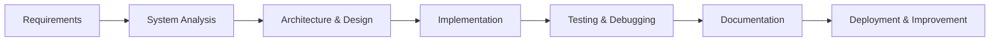

<!-- Profile Header -->
<p align="center">
  
</p>

<!-- Typing Animation -->
<p align="center">
  
</p>

---

<h2 align="center">👋 Hello, I'm Hamza Baddad</h2>

<h3 align="center">
  Software Engineer | Systems Analyst | Full-Stack & Embedded Systems Developer
</h3>

<p align="center">
  I design, analyze, and build software systems from the ground up — from understanding requirements and system logic to writing clean, scalable, and maintainable code.
</p>

---

<!-- Professional Badges -->
<p align="center">
  
  
  
  
</p>

---

## 🚀 About Me

```cpp
class HamzaBaddad {
public:
    string role = "Software Engineering Student";
    string focus = "Building systems from scratch";
    string strength = "System Analysis + Clean Architecture + C++";

    vector<string> skills = {
        "C++", "Java", "C#", "HTML", "CSS", "JavaScript",
        "Flutter", "Arduino", "Git", "GitHub"
    };

    string mindset() {
        return "Analyze deeply, design clearly, build professionally.";
    }
};
```

---

## 🧠 What I Do

<table>
  <tr>
    <td width="50%">
      <h3 align="center">🧩 System Analysis</h3>
      <p align="center">
        I understand requirements, analyze workflows, design system logic, and transform ideas into structured software solutions.
      </p>
    </td>
    <td width="50%">
      <h3 align="center">🏗️ Building Systems</h3>
      <p align="center">
        I can build complete systems from zero, including logic, structure, interfaces, and clean implementation.
      </p>
    </td>
  </tr>
  <tr>
    <td width="50%">
      <h3 align="center">💻 Software Development</h3>
      <p align="center">
        I develop applications using C++, Java, C#, JavaScript, Flutter, HTML, and CSS.
      </p>
    </td>
    <td width="50%">
      <h3 align="center">🔌 Embedded & Arduino</h3>
      <p align="center">
        I work with Arduino and hardware-based logic to connect software ideas with real-world devices.
      </p>
    </td>
  </tr>
</table>

---

## 🛠️ Tech Stack

<h3 align="center">Languages & Technologies</h3>

<p align="center">
  
</p>

<h3 align="center">Tools I Use</h3>

<p align="center">
  
</p>

---

## ⚙️ My Software Engineering Workflow



---

## 🎯 Professional Focus

<p align="center">
  <b>Clean Code</b> • 
  <b>Object-Oriented Programming</b> • 
  <b>System Design</b> • 
  <b>Problem Solving</b> • 
  <b>Full-Stack Development</b> • 
  <b>Embedded Systems</b>
</p>

---

<p align="center">
  
</p>
